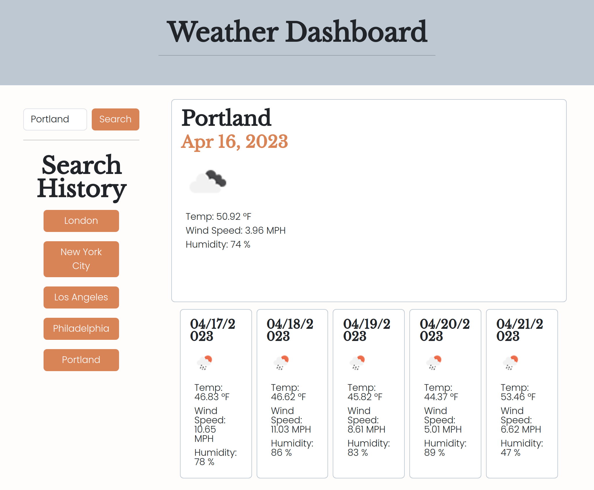

# Weather Dashboard Challenge-06
## Description
For this assignment, I was tasked with creating an in-browser weather dashboard application that retrieves data from an API to show weather conditions in a selected city for the current day as well as the forecast for the next five days with dynamically generated HTML and CSS.

My motivations were to really figure out and understand how to make user input interact with an API call to retrieve real-world information to solve a real-world problem (what is the weather going to be like?). I was able to do this project more independently than any of the other challenges so far, something I was happy with. I felt confident manipulating existing HTML, creating and appending elements to my web page, and it was honestly pretty neat to use data from the Geocoding API and construct URLs from strings to build upon the weather dashboard's functionality. I think the biggest turn in my understanding of JavaScript this project was being able to successfully build up a for loop that used one chunk of coding logic to gather the needed forecast data and dynamically append it to each forecast card on the page. I feel much better with iteration now!

One frustration I ran into but that ultimately helped to familiarize myself with Postman was an invalid API key. It took me a while to work out and the solution ended up just being creating a new key and waiting a few hours, but now I know how to use Postman to validate if my API call URL for next time and my new familiarity with Postman even ended up helping me to add parameter to my URL to transfer my data into imperial units of measurement.

## Languages, Libraries, & APIs Used
To accomplish this I used HTML, CSS, JavaScript, Bootstrap, dayJS, the 5 Day Weather Forecast API, and the Geocoding API. I also used localStorage to store persistent data in the browser.
## Usage
To use this weather dashboard, type a city of your choosing into the search bar and hit the search button. Weather information for today and the next five days will populate into the cards to the right (or below if you are on mobile). Your search history will also log beneath the search bar, and each entry can be clicked to search for the city again. When you refresh the page your search will persist, although it will clear once you search for a new entry.
## Screenshots

## Credits
## Link to Live, Deployed Page
[Weather Dashboard Challenge-06](https://josielynngriffin.github.io/weather-dash-challenge-06/index.html)